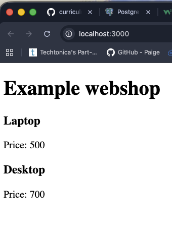

## Week 14 Quiz - Debugging, Git, & GitHub

You have just joined your favorite company and have been tasked with printing new data to a webpage. However, the existing files/directories are all jumbled up, and the code seems to have errors. Fix the bugs and sile structure.

1. Debug the broken code so that it's working
   a. rendering items.name and items.price instead of item.name and item.price
   b. app.listen placed before routes; moved to bottom
2. Correct the file architecture using command line
   a. cd Week14_Quiz1 -> mv node_modules server
3. node_modules are committed, remove them from repo on GitHub
   a. add node_modules to .gitignore
4. Correct the server file’s directory by moving it to the appropriate directory
   a. cd client -> mv server ..
5. Update README with
   - screenshot of the app's webpage
     
